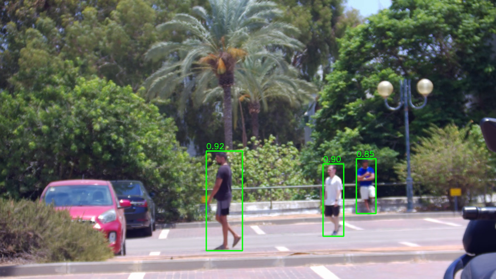
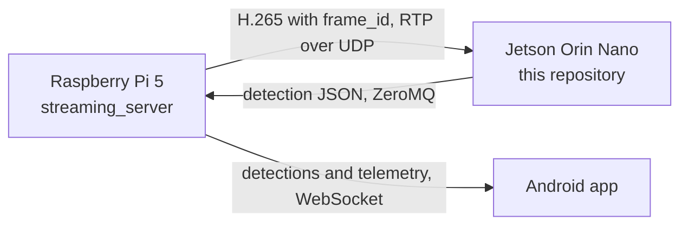
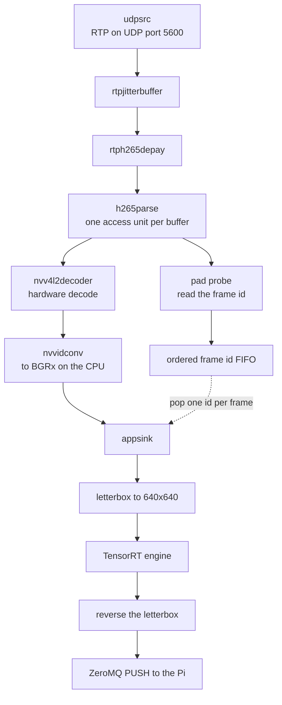
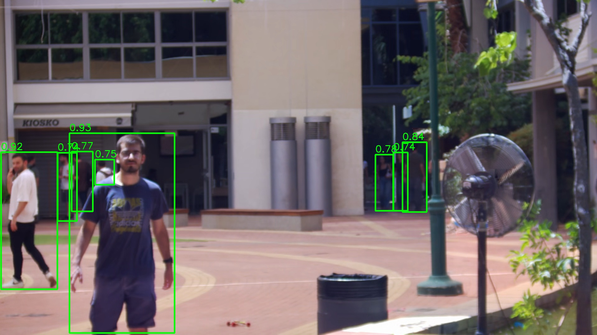

# SnipeIt Detection Node

The detection node of [SnipeIt](https://github.com/emilglater/SnipeIt), a
remotely operated reconnaissance and fire-solution platform. It runs on a
Jetson Orin Nano. Frames come in over the network, detections go back out.

This node is stateless. It never sees where the camera is pointing, how far
away anything is, or what the servo arm is doing. It receives a frame, finds
the people in it, and returns boxes in the coordinates of that frame. All
geometry, pose recovery, tracking and servo control stay on the Raspberry Pi.



*Three targets at once. Box heights of 386, 280 and 212 pixels, at 0.92, 0.90
and 0.85 confidence.*

## Where this fits

| Part | Repository | Role |
|---|---|---|
| Pi | [`SnipeIt`](https://github.com/emilglater/SnipeIt) | The master hub. Owns the camera, the servo arm, the sensors and the app link |
| Orin | this repository | The detection node |
| App | [`SnipeItApp/MySnipeIt`](https://github.com/emilglater/SnipeIt/tree/main/SnipeItApp/MySnipeIt) | The Android companion app |



Two contracts join the Pi and this node. The Pi's README is the reference for
both:
[frames to the Orin](https://github.com/emilglater/SnipeIt#wire-contract-a---frames-to-the-orin)
and
[detections back to the Pi](https://github.com/emilglater/SnipeIt#wire-contract-b---detections-back-to-the-pi).
The sections below describe what this node has to do to hold up its end of
each.

## The detection pipeline

One GStreamer pipeline receives the stream and decodes it on the GPU. Each
decoded frame then goes through the detector and out as one message.



The hard part is the dashed line. Every frame carries an id that the Pi needs
back, and that id has to survive the trip through the decoder.

It cannot. The id is written into the compressed stream, and a decoded frame is
just pixels. By the time the decoder produces an image, the id is gone.

So the id is never read from the decoded frame. A probe sits on the parser
output, ahead of the decoder, where the compressed data is still intact. It
reads the id out of each unit and pushes it onto a queue. The other end of the
pipeline pops one id per decoded frame. Because the units arrive in order and
each one produces exactly one frame, the two stay lined up.

- **[Why the id is recovered before the decoder](https://github.com/giladf424/smart-spotter-orin/blob/9cb41196339a78bd92a73cb2feb061fbeb170fe9/app/ingest/pipeline.py#L1-L30)** -
  the design in full, including the two conditions that keep the queue in step
  and the command that checks them.
- **[Building the pipeline](https://github.com/giladf424/smart-spotter-orin/blob/9cb41196339a78bd92a73cb2feb061fbeb170fe9/app/ingest/pipeline.py#L104-L184)** -
  assembled as one description string, then the probes are attached to elements
  by name. The same code runs a captured file instead of the network by
  swapping the source element.
- **[Reading the id off each unit](https://github.com/giladf424/smart-spotter-orin/blob/9cb41196339a78bd92a73cb2feb061fbeb170fe9/app/ingest/pipeline.py#L204-L251)** -
  runs once per compressed unit. It also holds decoding back until the first
  keyframe arrives, because a decoder that starts mid-sequence is missing the
  reference frames it needs.
- **[Pairing an id with a frame](https://github.com/giladf424/smart-spotter-orin/blob/9cb41196339a78bd92a73cb2feb061fbeb170fe9/app/ingest/pipeline.py#L254-L280)** -
  the other end. Pop the queue and hand the caller one frame and the id that
  belongs to it.

## Frames in

The Pi sends H.265 video over RTP on UDP, at about 3 frames per second.

H.265 carries everything in Network Abstraction Layer (NAL) units. One kind,
Supplemental Enhancement Information (SEI), is optional by definition, so any
decoder that does not recognise it skips it. That makes SEI the safe place to
carry a frame id, and it is where the Pi puts one.

Reading it back takes three steps, because the format has two traps in it.

The first trap is that the encoder writes its own SEI units. They have the same
unit type and the same payload type as ours. Matching on those alone would read
the encoder's version string as a frame id. The payload therefore opens with a
16-byte UUID that both sides agree on, and only a unit carrying that UUID is
accepted.

The second trap is that an H.265 stream may never contain the byte run
`00 00 01`, because that run marks the start of the next unit. An encoder that
would otherwise produce it inserts an extra `03` byte to break it up. Those
bytes have to come back out before the payload can be read, or the frame id
comes back wrong.

- **[Walking the units](https://github.com/giladf424/smart-spotter-orin/blob/9cb41196339a78bd92a73cb2feb061fbeb170fe9/app/ingest/sei.py#L34-L65)** -
  collects every start-code offset first, so each unit's end is known before
  any of them are read.
- **[Removing the inserted bytes](https://github.com/giladf424/smart-spotter-orin/blob/9cb41196339a78bd92a73cb2feb061fbeb170fe9/app/ingest/sei.py#L68-L84)** -
  the exact inverse of what the Pi does on the way out.
- **[Reading the frame id](https://github.com/giladf424/smart-spotter-orin/blob/9cb41196339a78bd92a73cb2feb061fbeb170fe9/app/ingest/sei.py#L87-L132)** -
  walks the payload type and size fields, which use a variable-length
  encoding, then accepts a unit only on a UUID match.

## The model

A YOLO26-m detector, trained off this device, single class, person only. It was
trained on a merged dataset of about 73,000 training images and 7,000
validation images, drawn from the outdoor person images of COCO 2017 and from
WiderPerson. On the validation split it reached 0.82 precision, 0.71 recall and
0.81 mAP50.

Two properties of the export shape the code that reads it. The input is a fixed
640x640 square, so the input size is decided by the exported model rather than
by configuration. And the export is end to end, meaning it produces a fixed
300-row output with non-maximum suppression already applied inside the graph.
Nothing downstream merges overlapping boxes, because there are none left to
merge. Rows are filtered on confidence and nothing else.

The confidence threshold is 0.35, which is low for a detector. That is
deliberate. This system is looking for people, and a person it fails to report
is a worse outcome than a box drawn around something that turns out to be a
bush. The threshold is set low so a marginal detection is passed on rather than
discarded, and the occasional extra box is accepted as the cost.

Filtering is this node's responsibility alone. The app applies no threshold and
no class filter, and draws every detection it is given.

- **[Every tunable in one file](https://github.com/giladf424/smart-spotter-orin/blob/9cb41196339a78bd92a73cb2feb061fbeb170fe9/app/config.py#L1-L60)** -
  the class map, the threshold, the frame size and the ZeroMQ endpoint, with
  the procedure for swapping in a different model written at the top.

## Boxes in source-frame pixels

The Pi expects boxes in the coordinates of the full 1920x1080 frame it sent.
The detector works on a 640x640 square. Something has to convert between them,
and it has to be exact, because the Pi turns these pixels into a real-world
bearing.

A 1920x1080 frame is not square, so it cannot be resized to 640x640 without
distorting it. Instead it is scaled down until the long edge fits, and the
short edge is padded out to fill the square. A 1920x1080 frame scales by 1/3 to
640x360, leaving 140 pixels of padding above and below.

Every box then comes back sitting in that padded square, offset by the padding
and shrunk by the scale. Undoing it is subtract the padding, divide by the
scale. The forward step records the exact integer padding it applied so the
reverse step can use the same number.



*Eight targets in one frame, from a subject a few metres away to a group across
the plaza.*

- **[The record that makes the reverse possible](https://github.com/giladf424/smart-spotter-orin/blob/9cb41196339a78bd92a73cb2feb061fbeb170fe9/app/detect/postprocess.py#L30-L42)** -
  the scale, the padding and the source dimensions, with the reverse written
  out as two lines of arithmetic.
- **[Fitting a frame into the square](https://github.com/giladf424/smart-spotter-orin/blob/9cb41196339a78bd92a73cb2feb061fbeb170fe9/app/detect/postprocess.py#L58-L98)** -
  resize, pad, convert to the layout the model expects.
- **[Getting source pixels back](https://github.com/giladf424/smart-spotter-orin/blob/9cb41196339a78bd92a73cb2feb061fbeb170fe9/app/detect/postprocess.py#L101-L150)** -
  filter on confidence, reverse the padding and the scale, clamp anything the
  model predicted past the frame edge, and sort by confidence.

## The engine

The model ships as an ONNX file. TensorRT compiles that into an engine tuned
for the exact GPU and driver it will run on, which is why the engine is built
on the device rather than shipped with the repository.

Compiling takes minutes, so the result is cached. The cache key is a
fingerprint of everything that would invalidate it, and the build writes to a
temporary path and moves the result into place, so an interrupted build cannot
leave a half-written engine that the cache would trust.

- **[Build or reuse](https://github.com/giladf424/smart-spotter-orin/blob/9cb41196339a78bd92a73cb2feb061fbeb170fe9/docker/entrypoint.sh#L30-L62)** -
  the fingerprint is the hash of the model file, the TensorRT version, the
  input size and the precision.
- **[Setting the engine up](https://github.com/giladf424/smart-spotter-orin/blob/9cb41196339a78bd92a73cb2feb061fbeb170fe9/app/detect/engine.py#L44-L96)** -
  the shapes are fixed, so the buffers are allocated once at startup and reused
  for every frame rather than allocated per call.
- **[One forward pass](https://github.com/giladf424/smart-spotter-orin/blob/9cb41196339a78bd92a73cb2feb061fbeb170fe9/app/detect/engine.py#L102-L140)** -
  copy in, run, copy out, and synchronise once. The result is returned as a
  copy, so the caller can hold onto it past the next frame.

## Detections out

One message per decoded frame, as JSON, over a ZeroMQ PUSH socket. The Pi binds
and this node connects, which means this node can be restarted on its own
without the Pi noticing or needing to be reconfigured.

```json
{
  "type": "target_detection",
  "frame_id": 12345,
  "timestamp_ms": 678,
  "detections": [
    { "id": "1", "class": "HUMAN", "confidence": 0.85,
      "bbox": {"x": 100, "y": 50, "width": 200, "height": 400} }
  ]
}
```

`frame_id` is the echo of the id read out of the stream, and it is the only
thing the two sides join on. The Pi keeps a record of where the camera was
pointing for each id, so returning the id is what lets it place the detection
in the world.

`detections[].id` is a label within one message. It counts from 1 and it means
nothing across frames. Recognising the same person from one frame to the next
needs to know how the camera moved in between, and this node has no way of
knowing that, so the Pi runs its own tracker and replaces these labels with
stable track ids before the app ever sees them.

A frame with nothing in it still produces a message with an empty list. That is
not a formality. It is what tells the app to clear the boxes it is drawing.

- **[Building the message](https://github.com/giladf424/smart-spotter-orin/blob/9cb41196339a78bd92a73cb2feb061fbeb170fe9/app/egress/zmq_sink.py#L48-L78)** -
  rounds boxes to whole pixels and caps the list at 32, keeping the most
  confident, which is why the list arrives sorted.
- **[The socket](https://github.com/giladf424/smart-spotter-orin/blob/9cb41196339a78bd92a73cb2feb061fbeb170fe9/app/egress/zmq_sink.py#L31-L46)** -
  sending happens on the thread that decodes video, so the send is bounded and
  never blocks. Decode runs at its own pace whatever the network is doing.
- **[One frame, end to end](https://github.com/giladf424/smart-spotter-orin/blob/9cb41196339a78bd92a73cb2feb061fbeb170fe9/app/infer.py#L59-L73)** -
  the whole chain in a dozen lines, shared by all three ways of running the
  node.

## Running it

Everything runs in a container. The image carries TensorRT and the general
GStreamer framework, but deliberately not NVIDIA's hardware video plugins.
Those are mounted in from the host at run time, which keeps the image
independent of the exact board it runs on.

- **[The GStreamer layer](https://github.com/giladf424/smart-spotter-orin/blob/9cb41196339a78bd92a73cb2feb061fbeb170fe9/docker/Dockerfile#L44-L59)** -
  what is installed, and why the hardware plugins are not.

```bash
docker build -t smart-spotter-orin:dev docker/

docker run --rm -it --runtime nvidia \
  -e NVIDIA_VISIBLE_DEVICES=nvidia.com/gpu=all \
  --network host \
  -v "$PWD/models:/models" -v "$PWD/app:/app" \
  smart-spotter-orin:dev
```

That builds or reuses the engine, then starts the service. There are three ways
to run the detector:

| Mode | Command | Use |
|---|---|---|
| Live | `infer.py --source live` | The real thing. Receives from the Pi, pushes detections back |
| Replay | `infer.py --source file --file <capture>` | Runs a saved capture through the same code, without the Pi |
| Single frame | `infer.py --test-image <jpg>` | One image in, the JSON message printed out |

## Verification

Model files and video captures are build artifacts, so they are kept out of the
repository. `models/frame_00347.jpg` is the exception, because it is the fixed
input for the first check.

**The detector.** A 1920x1080 frame with two people in it.

```bash
python3 /app/infer.py --engine /models/model.engine \
    --test-image /models/frame_00347.jpg
```

Two `HUMAN` detections, at 0.9238 and 0.9126.

**Decoding and frame ids.** This needs a capture that carries them.
`pi_sei_sample.hevc` is a colour bar test pattern of 42 frames with ids 1 to
42. It contains no people at all, which is the point. It separates the question
"did the stream decode and did every id survive" from anything to do with
detection, so zero detections is the correct result for it.

```bash
python3 /app/tools/probe.py --file /models/pi_sei_sample.hevc
```

All 42 ids recovered, in order, at 1920x1080.

The same command runs against the live stream with `--live`, which is how the
pairing is checked against the Pi rather than against a file.

**Style.** `ruff check .` from the repository root.
